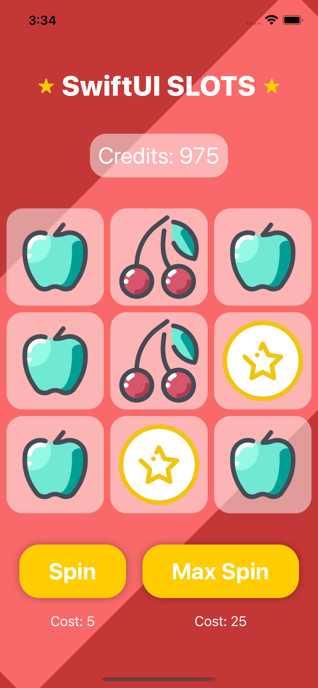
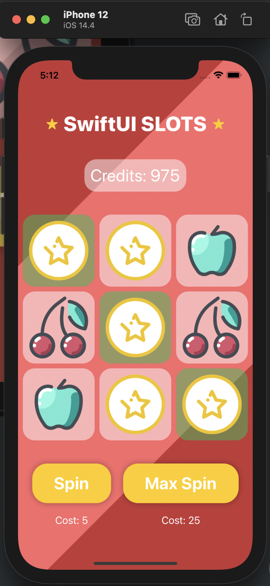
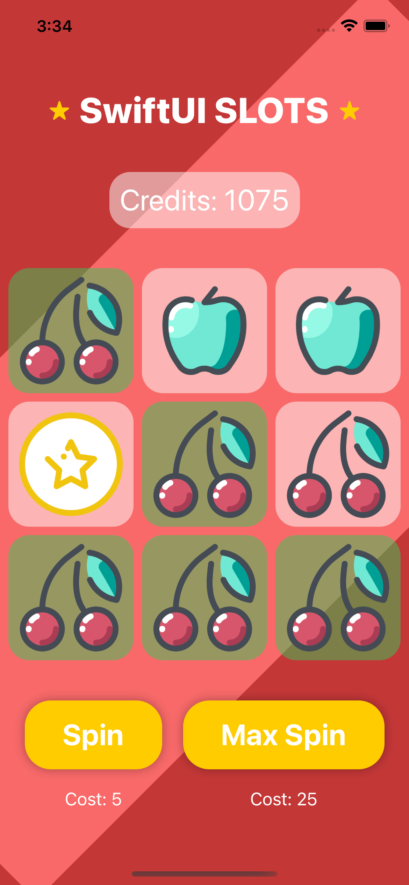

# slots-game
An introductory iOS app that allows the user to play slots. Utilises Swift and SwiftUI

There are two buttons in which the user can use to play the game
* The first being a simple spin which will only roll the middle row in which the user will win if all middle icons match.
* The second button (Max Spin) will allow the user to roll all 3 rows and will succeed if there are any matches in a row or diagonally.

### An example of a diagonal win

### An example of multiple wins

